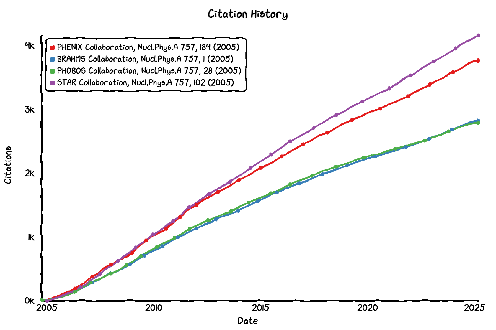
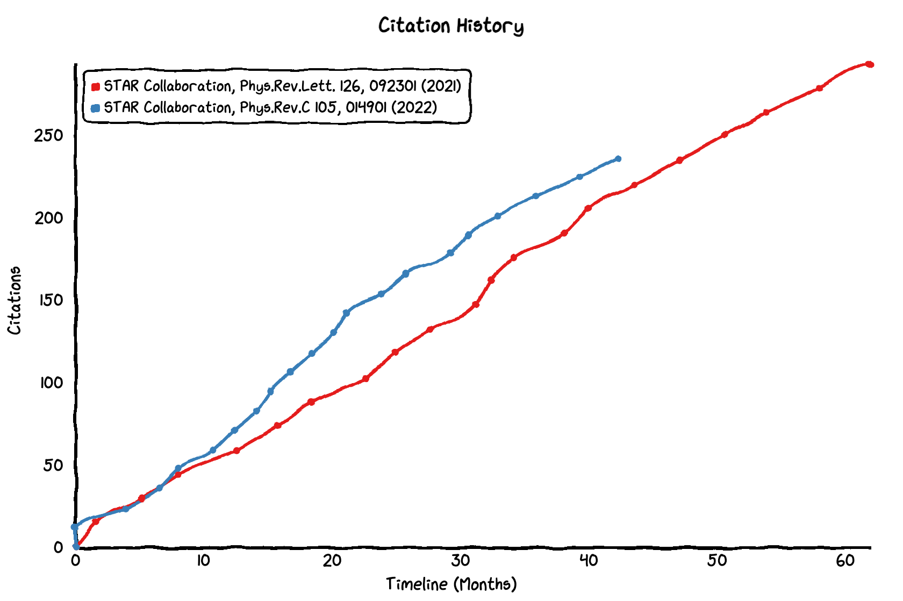

# INSPIRE Citation History

A web-based tool to visualize citation history for academic papers indexed in the INSPIRE-HEP database.

  

  <a href="https://vovchenko.net/inspire-citation-history/"><strong>Try it online</strong></a>

## Overview

This project provides a simple, interactive web interface to track and compare citation histories of high-energy physics papers over time. It's inspired by **[GitHub Star History](https://star-history.com)** tool but applied to academic citations.

This is a personal project and is not affiliated with the INSPIRE-HEP database. 
I do not have much experience with web development, and was interested in learning how to build a web application with the help of AI tools (it probably counts as [vibe coding](https://en.wikipedia.org/wiki/Vibe_coding)).
While the AI coding assistant (Windsurf + Claude Sonnet 3.7) has been immensely helpful, I did have to fix some of the issues during the development myself.

## Features

- Track citation history for multiple papers simultaneously
- Compare citation trajectories across different papers
- Option to align timelines to normalize publication dates
- Read multiple INSPIRE-HEP record IDs through URL
- Export the graph to a file

## Usage

1. Visit [https://vovchenko.net/inspire-citation-history](https://vovchenko.net/inspire-citation-history) or open `inspire-citation-history.html` locally in your web browser
2. Enter an INSPIRE-HEP record ID in the input field (e.g., `2178285`) or paste a full INSPIRE-HEP URL (e.g., `https://inspirehep.net/literature/2178285`)
3. Click "Add record" to add the paper to your visualization
4. Add multiple papers to compare citation histories
5. Toggle "Align timeline" to normalize all citation histories to start at the same point
6. Click "Clear all" to remove all records and reset the chart

### Alternative Usage: URL Parameters

You can also directly share specific citation histories by using URL parameters, for example: [https://vovchenko.net/inspire-citation-history/?recids=1850675-1914564](https://vovchenko.net/inspire-citation-history/?recids=1850675-1914564)

### Example Queries

Here are some example queries for interesting paper comparisons:

- **RHIC QGP Assesment Papers**: [?recids=661031-661961-662061-674863](https://vovchenko.net/inspire-citation-history/?recids=661031-661961-662061-674863)

- **Compare STAR measurements of proton cumulants and CME (aligned timelines)**: [?recids=1850675-1914564&align=true](https://vovchenko.net/inspire-citation-history/?recids=1850675-1914564&align=true)

## Technical Details

The application is built as a single HTML file with embedded JavaScript that:

- Makes API calls to the [INSPIRE-HEP REST API](https://github.com/inspirehep/rest-api-doc) to retrieve citation data
- Processes the raw citation data into time series format
- Visualizes the data using the chart.xkcd library for a hand-drawn aesthetic

**Note on Performance**: Due to the limitations of the API, the web application will retrieve up to 250 citation records at a time for each paper. This can cause some delay for large numbers of citations. Please be patient while the charts are loading. Sometimes the process will halt, especially if you are adding many papers at once. There is also rate limiting enforced by INSPIRE API (15 requests per 5 second window)

## Potential Future Improvements

- [ ] Improve performance by caching citation data and/or optimizing API calls
- [ ] Customize chart appearance (colors, line styles)
- [ ] Add support for arXiv and/or DOI identifiers
- [ ] Implement better error handling for API rate limits
- [ ] Utilizing other citation databases

## Dependencies

- [Chart.js](https://www.chartjs.org/) - Base charting library
- [chart.xkcd](https://github.com/timqian/chart.xkcd) - For the hand-drawn chart style
- [date-fns](https://date-fns.org/) (via chartjs-adapter-date-fns) - For date handling

## License

This project is open source and available under the [MIT License](LICENSE).

## Acknowledgments

- [INSPIRE-HEP](https://inspirehep.net) for providing the [API to access citation data](https://github.com/inspirehep/rest-api-doc)
- [GitHub Star History](https://star-history.com) for the inspiration
- [Windsurf](https://www.jetbrains.com/windsurf/) for the AI-powered coding assistant

*Copyright (C) 2025 Volodymyr Vovchenko*