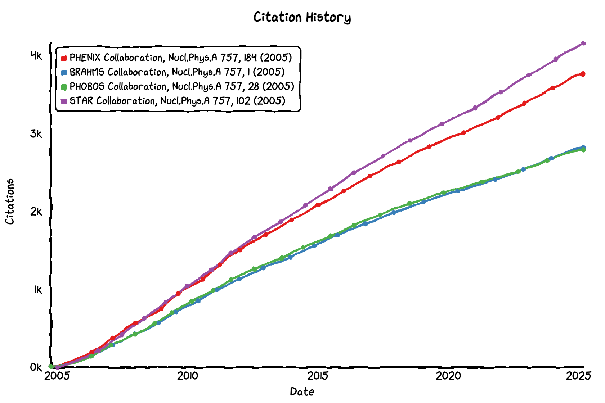
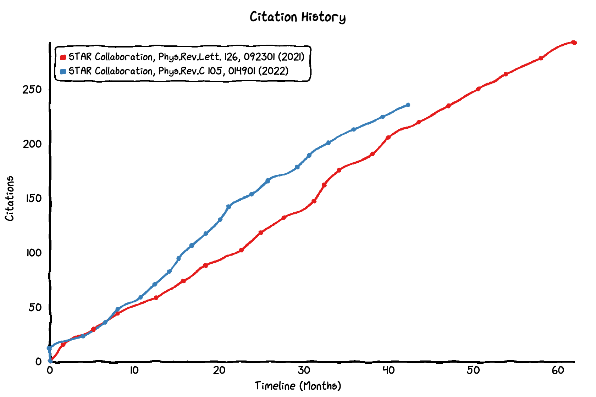

# INSPIRE Citation History

A web-based tool to visualize citation history for academic papers indexed in the INSPIRE-HEP database.

  

  <a href="https://vovchenko.net/inspire-citation-history/"><strong>Try it online</strong></a>

## Overview

This project provides a simple, interactive web interface to track and compare citation histories of high-energy physics papers over time. It's inspired by **[GitHub Star History](https://star-history.com)** tool but applied to academic citations.

This is a personal project and is not affiliated with the INSPIRE-HEP database. 
I do not have much experience with web development, and was interested in learning how to build a web application with the help of AI tools (it probably counts as [vibe coding](https://en.wikipedia.org/wiki/Vibe_coding)).
While the AI coding assistant (Windsurf + Claude Sonnet 3.7) has been immensely helpful, I did have to fix some of the issues during the development myself.

## Features

- Track citation history for multiple papers simultaneously
- Add records by INSPIRE record ID, arXiv identifier, or DOI (also as URLs)
- Compare citation trajectories across different papers
- Citation rate view: time-dependent citation rate (citations/year) with 68% uncertainty bands, treating citations as an inhomogeneous Poisson process. Three estimators: smooth (boundary-corrected Gaussian kernel, default), binned histogram, and Bayesian blocks (optimal change-point segmentation, [Scargle et al. 2013](https://arxiv.org/abs/1207.5578))
- Optional model fit ([Wang, Song & Barabási 2013](https://www.science.org/doi/10.1126/science.1237825)): overlays the fitted citation model on the rate view and projects each paper's ultimate citation count with bootstrap uncertainties. Requires at least 5 years of history and 50 citations, and the projection is shown only when the fitted aging curve has passed its peak within the observed window and the bootstrap is well-behaved — before the turnover, "still rising" and "rises forever" cannot be distinguished (Wang, Mei & Hicks 2014); the fitted curve itself is drawn regardless. Fits poorly for papers with multi-burst citation histories
- Option to align timelines to normalize publication dates
- Read multiple INSPIRE-HEP record IDs through URL
- Export the graph to a file

## Usage

1. Visit [https://vovchenko.net/inspire-citation-history](https://vovchenko.net/inspire-citation-history) or open `inspire-citation-history.html` locally in your web browser
2. Enter an INSPIRE-HEP record ID (e.g., `2178285`), an arXiv identifier (e.g., `2208.06843`, `arXiv:2208.06843`, or `hep-ph/9803241`), or a DOI (e.g., `10.1103/PhysRevLett.126.092301`) in the input field. Full `inspirehep.net`, `arxiv.org`, and `doi.org` URLs are also accepted; arXiv IDs and DOIs are resolved to INSPIRE records via the INSPIRE API
3. Click "Add record" to add the paper to your visualization
4. Add multiple papers to compare citation histories
5. Toggle "Align timeline" to normalize all citation histories to start at the same point
6. Toggle "Citation rate" to switch from the cumulative citation count to the citation rate (citations per year), shown with 68% Poisson uncertainty bands. The estimator selector offers a smooth kernel estimate (default), a binned histogram, and Bayesian blocks — an optimal piecewise-constant segmentation whose steps sit at data-determined change points (resolved no finer than one month), useful for spotting when interest in a paper jumped; its sensitivity selector sets the false-alarm probability per change point (Strict 0.05 by default, Moderate 0.3, Eager 0.9). The smoothing scale / bin width is chosen automatically and can be overridden. The part of the curve near the present is drawn dashed since recent citations may not be indexed yet
7. Click "Clear all" to remove all records and reset the chart

In the rate view, the CSV export contains the rate series (rate, 68% interval bounds, and the per-point citation count or effective count) instead of the cumulative counts.

### Alternative Usage: URL Parameters

You can also directly share specific citation histories by using URL parameters, for example: [https://vovchenko.net/inspire-citation-history/?recids=1850675-1914564](https://vovchenko.net/inspire-citation-history/?recids=1850675-1914564)

Supported parameters: `recids` (dash-separated record IDs), `align=true` (align timelines), `rate=true` (citation rate view), `est` (rate estimator: `binned` or `blocks`; smooth is the default), `p0` (Bayesian-blocks sensitivity: `0.3` or `0.9`; `0.05` is the strict default), `wsb=true` (overlay the Wang–Song–Barabási model fit), and `bin` (smoothing scale / bin width in months: 1, 3, 6, or 12; omit for automatic)

### Example Queries

Here are some example queries for interesting paper comparisons:

- **RHIC QGP Assesment Papers**: [?recids=661031-661961-662061-674863](https://vovchenko.net/inspire-citation-history/?recids=661031-661961-662061-674863)

- **Compare STAR measurements of proton cumulants and CME (aligned timelines)**: [?recids=1850675-1914564&align=true](https://vovchenko.net/inspire-citation-history/?recids=1850675-1914564&align=true)

## Technical Details

The application is built as a single HTML file with embedded JavaScript that:

- Makes API calls to the [INSPIRE-HEP REST API](https://github.com/inspirehep/rest-api-doc) to retrieve citation data
- Processes the raw citation data into time series format
- Visualizes the data using the chart.xkcd library for a hand-drawn aesthetic

**Note on Performance**: Citation records are retrieved 500 at a time, requesting only the citation dates (`fields=earliest_date`), which keeps responses small and loading fast even for highly cited papers. All API calls share a rate limiter that stays below INSPIRE's limit of 15 requests per 5-second window, and requests are automatically retried with exponential backoff on rate-limit (429) or server errors, so loading many papers at once should slow down gracefully rather than halt. Fetched citation data is additionally cached in the browser's localStorage for 24 hours: recently viewed papers and shared links render instantly, and stale entries are refreshed in the background.

**Note on citation dates**: Citing records with only year- or month-level date precision (common for conference proceedings and theses) are spread evenly across their year or month instead of being piled on January 1, which would otherwise produce phantom spikes in the citation rate. Dates of exactly January 1 are treated as year precision and dates on the 1st of other months as month precision, since these usually reflect journal issue dating rather than actual appearance dates.

### Testing

The `tests/` directory contains a plain-Node test suite (no dependencies to install): `estimator.test.js` validates the citation-rate estimators against exact Poisson intervals and Monte Carlo synthetic data, along with the record identifier parser and API retry backoff; `smoke.test.js` loads the page in headless Chrome/Chromium (auto-detected, override with `CHROME_BIN`) with stubbed chart libraries to check the UI wiring. Both run in CI on every push via GitHub Actions.

## Potential Future Improvements

- [x] Improve performance by caching citation data
- [x] Optimize API calls (slim responses, larger pages, request pacing)
- [ ] Customize chart appearance (colors, line styles)
- [x] Add support for arXiv and/or DOI identifiers
- [x] Implement better error handling for API rate limits
- [ ] Utilizing other citation databases

## Dependencies

- [Chart.js](https://www.chartjs.org/) - Base charting library
- [chart.xkcd](https://github.com/timqian/chart.xkcd) - For the hand-drawn chart style
- [date-fns](https://date-fns.org/) (via chartjs-adapter-date-fns) - For date handling

## License

This project is open source and available under the [MIT License](LICENSE).

## Acknowledgments

- [INSPIRE-HEP](https://inspirehep.net) for providing the [API to access citation data](https://github.com/inspirehep/rest-api-doc)
- [GitHub Star History](https://star-history.com) for the inspiration
- [Windsurf](https://codeium.com/windsurf) by Codeium for the AI-powered coding assistant

*Copyright (C) 2025 Volodymyr Vovchenko*